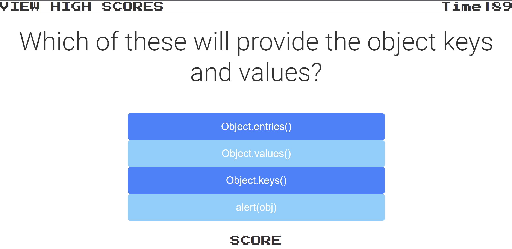

# M4: Coding Quiz
Project: Code a Software Developer specific trivia game that utilizes a timer function, objects and local storage.

# View live site @:[Trivia Coding Prep Game](https://dusticcus.github.io/M4-Trivia-Coding-Prep-Game/)

### Technologies Utilized
- HTML
- CSS
- JavaScript
- JSON
- Local Storage

## General Website Use
### Landing Page
 

- **Start Game Button**
    - Starts the game by presenting the first question and starting the timer
    - - 
- **View High Scores Button**
    - Will show you the 3 highest scores
        - 
    - Time
        - Will show remaining time until game over once game is started
        - Start Game
- **Answer the question by clicking 1 of the 4 buttons**
    - Right Answers will add 10 Points to your score
        -   
    - Wrong answers will reduce your remaining time by 20
        -   
    - A new high score will ask for your name to be added to the scoreboard
        - 
